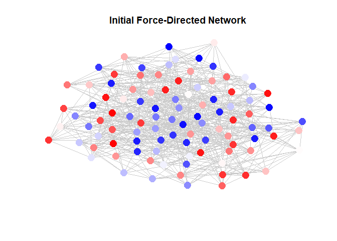
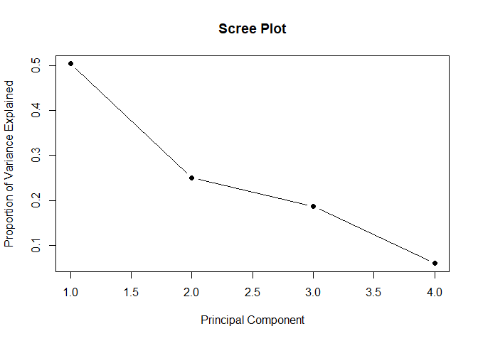
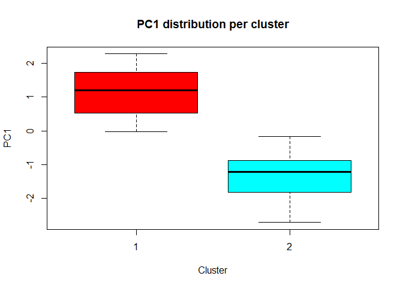
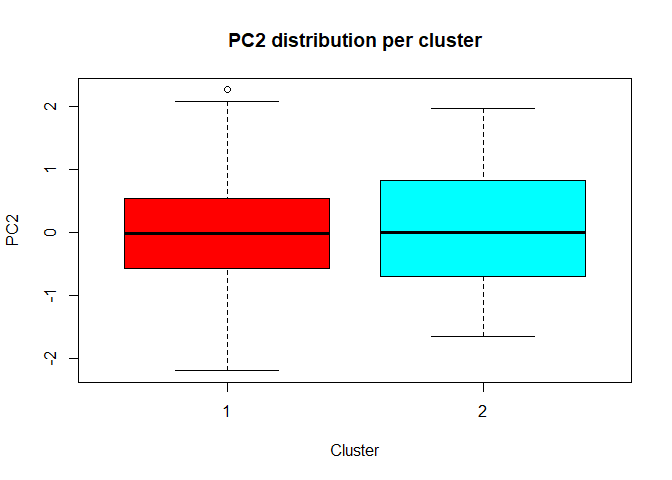
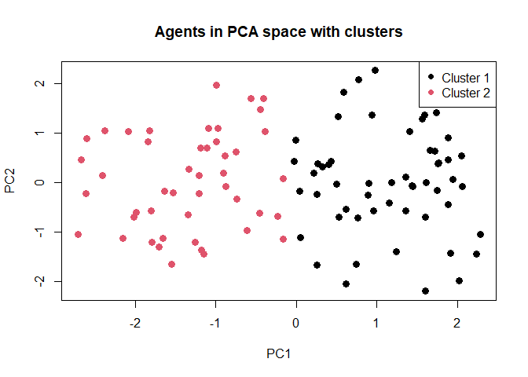

# [`dsitR`](https://github.com/cwendorf/dsitR/)

## Advanced Example

This vignette provides a more advanced example of how to use the `dsitR`
package to conduct a simulation, visualize the results, and assess the
outcomes. The example is designed to be more complex and detailed,
making it suitable for those who have some experience with the package
or with agent-based modeling in general. It uses force-directed graphs
to visualize the simulation, which can reveal more complex patterns and
interactions among agents. The assessment section includes a Principal
Components Analysis (PCA) to identify underlying dimensions of opinion
change and clustering to identify groups of agents with similar opinion
trajectories.


- [Conduct the Simulation](#conduct-the-simulation)
- [Visualize the Simulation](#visualize-the-simulation)
- [Assess the Simulation](#assess-the-simulation)

------------------------------------------------------------------------

### Conduct the Simulation

Create the agents and neighborhoods for the network.

``` r
# Initialize a larger network with multiple opinions
agents <- create_agents(rows=10, cols=10, opinions=4)

# Use a more complex neighborhood structure
neighborhood <- create_neighborhood(agents, neighbors_moore_outside)
```

Run and verify the simulation based on the neighborhood.

``` r
# Run a longer and slower simulation
result <- run_simulation(agents, neighborhood=neighborhood, steps=100, rate=.05)

# View the first few rows of the simulation to see what is produced
head(result)
```

      x y id    opinion1 strength1      opinion2 strength2    opinion3 strength3
    1 1 1  1 -0.60870567 0.6285189  0.5720521289 1.0311226 -0.40727062  1.299745
    2 2 1  2  0.03087034 1.1652460 -0.6181793617 1.0498831 -0.69787253  1.383974
    3 3 1  3 -0.46785061 0.9745055  0.0005539745 0.8579341  0.86901766  1.352837
    4 4 1  4 -0.84505531 1.0045715  0.6971720124 1.3240946 -0.02541817  0.884834
    5 5 1  5 -0.55291301 0.9889027 -0.1067662805 1.2002710  0.54580222  1.273575
    6 6 1  6 -0.62750306 0.5213131 -0.7704703725 0.6854032  0.27379459  0.677459
        opinion4 strength4 time
    1 -0.9316298 0.8451584    1
    2  0.7003913 1.1693010    1
    3  0.6066673 0.5241504    1
    4 -0.5100316 0.5206350    1
    5  0.4537602 1.0262639    1
    6  0.1069865 1.3493602    1

### Visualize the Simulation

Visualize the a step using a force-directed graph.

``` r
# Visualize just the initial step
frame1 <- subset(result, time==1)
plot_network(frame1,
  neighborhood=neighborhood,
  opinion="opinion1",
  main="Initial Force-Directed Network"
)
```

<!-- -->

Visualize the entire simulation to unveil changes and patterns.

``` r
# Animate the changes in the force-directed graph
animate_network(result,
  neighborhood=neighborhood,
  opinion="opinion1",
)
```

### Assess the Simulation

Prepare for and conduct the Principal Components extraction.

``` r
# Extract opinions from the final frame
frame <- subset(result, time == 100)
frame <- frame[, c("opinion1", "opinion2", "opinion3", "opinion4")]
head(frame)
```

            opinion1     opinion2     opinion3   opinion4
    9901 -0.03269197  0.094893502 -0.108611272 0.08949768
    9902 -0.05826814  0.070429806 -0.063945574 0.09361576
    9903 -0.06469998  0.029239768 -0.028881040 0.08983221
    9904 -0.03784076 -0.001206253 -0.010571180 0.08021135
    9905 -0.03181424 -0.017635742  0.006118588 0.10569715
    9906 -0.00573751 -0.037021456  0.015394753 0.10623352

``` r
# Run PCA and calculate component scores
frame_scaled <- scale(frame)
pca <- prcomp(frame_scaled, center = TRUE, scale. = TRUE)
scores <- pca$x
```

Determine the number of likely clusters in the data.

``` r
# k-means clustering in component space
summary(pca)
```

    Importance of components:
                              PC1    PC2    PC3     PC4
    Standard deviation     1.4197 1.0010 0.8629 0.48778
    Proportion of Variance 0.5039 0.2505 0.1861 0.05948
    Cumulative Proportion  0.5039 0.7544 0.9405 1.00000

``` r
pca$rotation
```

                    PC1         PC2         PC3        PC4
    opinion1  0.2042437 -0.94825683  0.04207194 -0.2394231
    opinion2 -0.6496200  0.05446758  0.13798023 -0.7456464
    opinion3  0.5664536  0.24338828 -0.53761221 -0.5752092
    opinion4 -0.4641214 -0.19648008 -0.83076141  0.2362676

``` r
var_explained <- summary(pca)$importance[2,]
plot(var_explained, type="b", pch=19,
     xlab="Principal Component",
     ylab="Proportion of Variance Explained",
     main="Scree Plot")
```

<!-- -->

``` r
# Choose number of clusters for later analyses
k <- 2
clusters <- kmeans(scores[,1:2], centers = k)$cluster
```

Assess the difference in component scores by cluster.

``` r
# Boxplots of components per cluster
boxplot(scores[,1] ~ clusters,
        xlab = "Cluster", ylab = "PC1",
        main = "PC1 distribution per cluster",
        col = rainbow(k))
```

<!-- -->

``` r
boxplot(scores[,2] ~ clusters,
        xlab = "Cluster", ylab = "PC2",
        main = "PC2 distribution per cluster",
        col = rainbow(k))
```

<!-- -->

``` r
# Scatterplot in PC1-PC2 space, colored by clusters
plot(scores[,1], scores[,2],
     col = clusters,
     pch = 19, cex = 1.2,
     xlab = "PC1", ylab = "PC2",
     main = "Agents in PCA space with clusters")
legend("topright", legend = paste("Cluster", 1:k), col=1:k, pch=19)
```

<!-- -->
