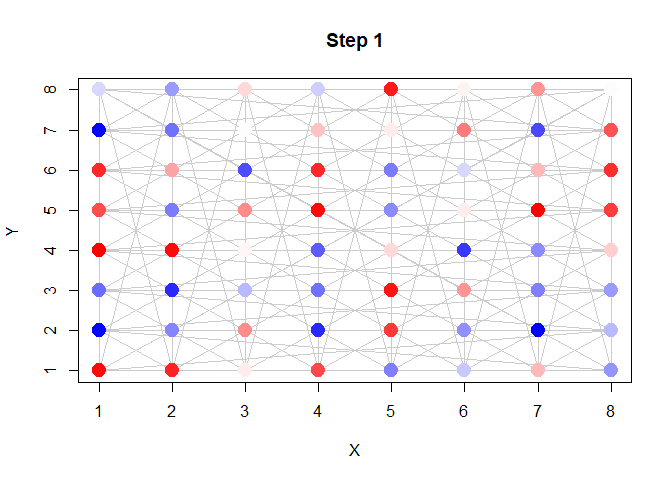
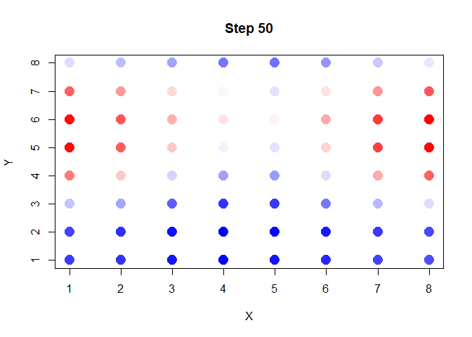
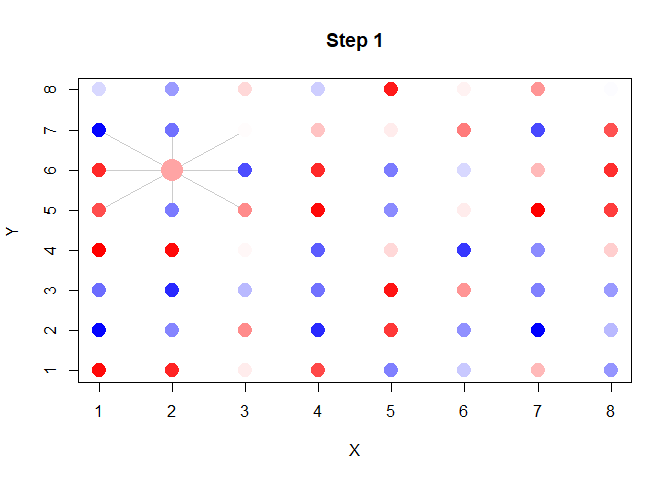
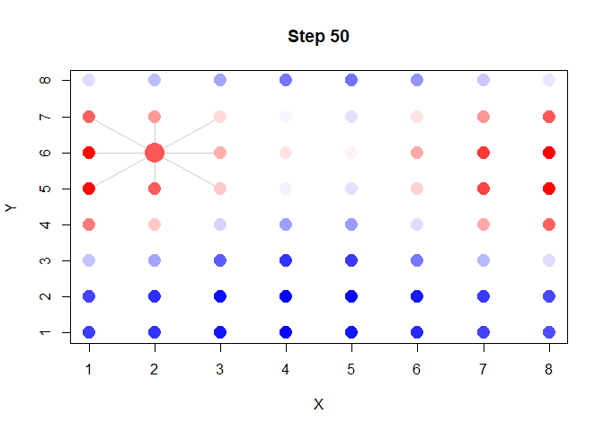
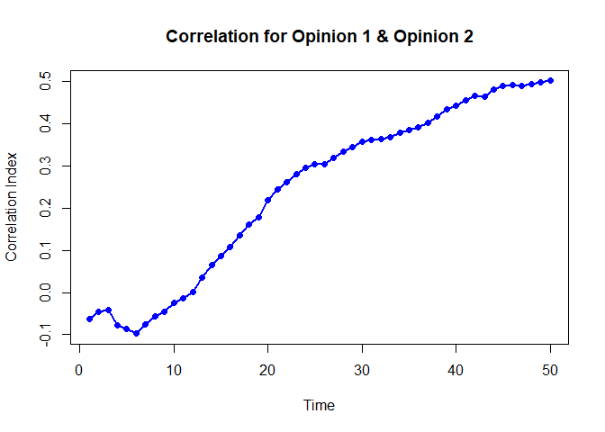
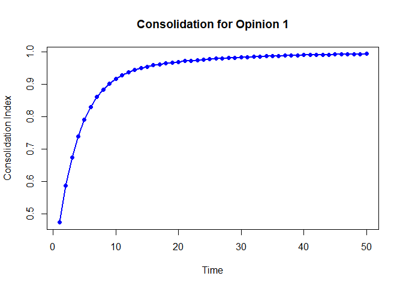
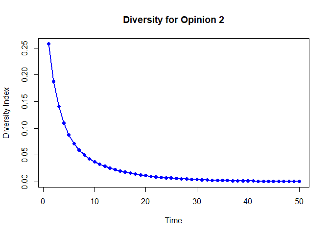

# [`dsitR`](https://github.com/cwendorf/dsitR/)

## Simple Example

This vignette provides a simple example of how to use the `dsitR`
package to conduct a simulation, visualize the results, and assess the
outcomes. The example is designed to be straightforward and easy to
follow, making it suitable for those new to the package or to
agent-based modeling in general. It uses grid plots to visualize the
simulation, making it easy to see the changes in opinions over time.

- [Conduct the Simulation](#conduct-the-simulation)
- [Visualize the Simulation](#visualize-the-simulation)
- [Assess the Simulation](#assess-the-simulation)

------------------------------------------------------------------------

### Conduct the Simulation

Identity the simulation parameters to determine the size and length of
the simulation.

``` r
rows <- 8
cols <- 8
opinions <- 2
steps <- 50
rate <- 0.2
```

Create the neighborhood based on the parameters and the type of
influence network.

``` r
# Initialize agents and initial opinions
agents <- create_agents(rows=rows, cols=cols, opinions=opinions)

# Define the interactions among the agents
neighborhood <- create_neighborhood(agents, neighbors_moore)
```

Run and verify the simulation based on the neighborhood and parameters.

``` r
# Run simulation using the neighborhood
result <- run_simulation(agents, neighborhood=neighborhood, steps=steps, rate=rate)

# View the first few rows of the simulation to see what is produced
head(result)
```

      x y id    opinion1 strength1   opinion2 strength2 time
    1 1 1  1  0.74491937 0.6638897  0.3811420 0.6734422    1
    2 2 1  2  0.66457768 0.8797811 -0.1423010 1.4710209    1
    3 3 1  3  0.06070258 0.7674778 -0.8334800 0.7257081    1
    4 4 1  4  0.56255816 0.9454056 -0.6773078 1.1519651    1
    5 5 1  5 -0.36204466 1.3949459 -0.5340484 1.0678578    1
    6 6 1  6 -0.14380533 1.1519411 -0.2162364 0.8487537    1

### Visualize the Simulation

Plot the neighborhood at specific steps (either with or without the
connections among agents).

``` r
# Plot Opinion 1 at the first step with edges
plot_step(
  subset(result, time == 1),
  neighborhood = neighborhood,
  opinion = "opinion1",
  edges = TRUE
)
```

<!-- -->

``` r
# Plot Opinion 1 at the final step without edges
plot_step(
  subset(result, time == 50),
  neighborhood = neighborhood,
  opinion = "opinion1",
  edges = FALSE
)
```

<!-- -->

Plot individuals at specific steps to highlight who they are influencing
(and are influenced by).

``` r
# Look at agent 42’s neighborhood at first step
frame <- subset(result, time == 1)
plot_individual(frame, neighborhood, id=42, opinion="opinion1")
```

<!-- -->

``` r
# Look at agent 42’s neighborhood at final step
frame <- subset(result, time == 50)
plot_individual(frame, neighborhood, coords=c(2,6), opinion="opinion1")
```

<!-- -->

Visualize the entire Simulation to unveil changes and patterns (with or
without connections).

``` r
# Animate all steps (with edges) for Opinion 1
animate_simulation(
  result,
  neighborhood = neighborhood,
  opinion = "opinion1",
  edges = TRUE
)

# Animate all steps (without edges) for Opinion 2
animate_simulation(
  result,
  neighborhood = neighborhood,
  opinion = "opinion2",
  edges = FALSE
)
```

### Assess the Simulation

Calculate metrics for specific steps in the simulation.

``` r
# Calculate the metrics for the first step
frame <- subset(result, time == 1)
compute_metrics(frame)
```

    $correlation
    opinion1_opinion2           average 
          -0.06231685       -0.06231685 

    $consolidation
     opinion1  opinion2   average 
    0.4728781 0.5111844 0.4920313 

    $diversity
     opinion1  opinion2   average 
    0.2123908 0.2575962 0.2349935 

    $clustering
     opinion1  opinion2   average 
    0.4728781 0.5111844 0.4920313 

``` r
# Calculate the metrics at the final step
frame <- subset(result, time == 50)
compute_metrics(frame)
```

    $correlation
    opinion1_opinion2           average 
            0.5017399         0.5017399 

    $consolidation
     opinion1  opinion2   average 
    0.9927545 0.9862281 0.9894913 

    $diversity
        opinion1     opinion2      average 
    0.0002010562 0.0006257163 0.0004133862 

    $clustering
     opinion1  opinion2   average 
    0.9927545 0.9862281 0.9894913 

Calculate and plot trends in the metrics.

``` r
# Calculate the trends in the metrics
trends <- compute_trends(result)
names(trends)
```

     [1] "time"                          "correlation.opinion1_opinion2"
     [3] "correlation.average"           "consolidation.opinion1"       
     [5] "consolidation.opinion2"        "consolidation.average"        
     [7] "diversity.opinion1"            "diversity.opinion2"           
     [9] "diversity.average"             "clustering.opinion1"          
    [11] "clustering.opinion2"           "clustering.average"           

``` r
# Plot the chosen metrics separately for opinions
plot_trend(trends, metric="correlation", opinion="opinion1_opinion2")
```

<!-- -->

``` r
plot_trend(trends, metric="consolidation", opinion="opinion1")
```

<!-- -->

``` r
plot_trend(trends, metric="diversity", opinion="opinion2")
```

<!-- -->
